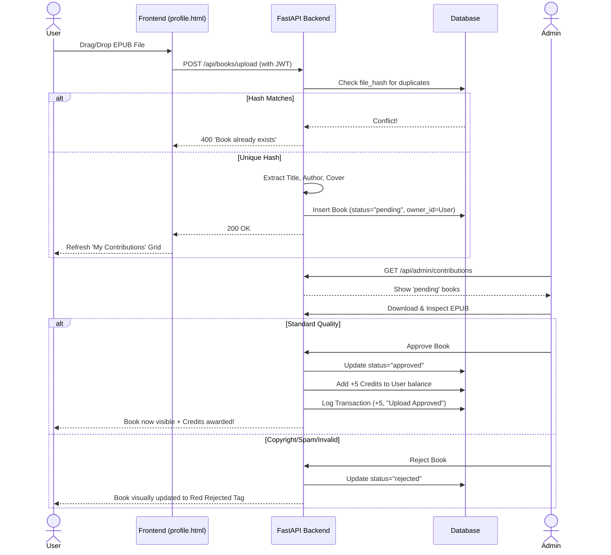

# User Account System Implementation & Flow (BookShelf)

This document outlines the finished implementation of the personal user accounts, the end-to-end contribution workflow, and moderation tools.

## 📋 Task Checklist (All Completed)

### Iteration 1: Database [✅]
- [x] Create `User` model (`email`, `hashed_password`, `is_verified`, `created_at`).
- [x] Add `owner_id` field to `Book` model (Many-to-One relationship).
- [x] Add `file_hash` field to `Book` model for duplicate prevention.

### Iteration 2: Registration and Verification [✅]
- [x] Create API endpoint for Signup.
- [x] Implement Email delivery service with JWT verification tokens.
- [x] Create page/endpoint to handle verification links (`/verify/{token}`).

### Iteration 3: Login and Security [✅]
- [x] Implement API endpoint for Login (Secure HTTP Bearer).
- [x] Implement "Forgot Password" functionality (SMTP Email with temporary recovery token).
- [x] Create Reset Password mechanism.
- [x] Create structured endpoint for account deletion `/api/auth/me`.

### Iteration 4: Profile Interface [✅]
- [x] Create `profile.html` mobile-first page.
- [x] Implement display of user status, auto-generated Member IDs, and join dates.
- [x] Add protected routing and context menus to logout or delete configuration.

### Iteration 5: Upload & Contribution Logic [✅]
- [x] Create robust API for user EPUB uploads (`/api/books/upload`).
- [x] Integrate `epub_service` for automatic metadata and cover extraction.
- [x] Block duplicate server uploads via `file_hash`.

### Iteration 6: Upload Visualization [✅]
- [x] Interactive upload area with instant dynamic grid refreshing.
- [x] "My Contributions" injected list showing statuses (Pending, Approved, Rejected).
- [x] Fallback cover rendering to handle meta-deficient EPUBs smoothly.

### Iteration 7: Admin Moderation Pipeline [✅]
- [x] Dedicated "Contributions" and "Upload History" tabs on Admin Dashboard.
- [x] Admins can `review/download` EPUBs natively before deciding.
- [x] Native Custom UI prompt modaling (Glassmorphism pop-ups).
- [x] Rejection Logic: Sets book status to `rejected`, retains in database to preserve history.

### Iteration 8: Credit Economy [✅]
- [x] Implement `CreditTransaction` model for historical tracking.
- [x] Gated Downloads: 1 book request = -1 credit deduction.
- [x] Community Rewards: +5 credits on admin upload approval.
- [x] Growth Incentives: +10 credits one-time bonus for enabling email notifications.
- [x] Admin Management: Manual credit adjustments via the "Users" dashboard tab.

---

## 🏛️ Contribution Architecture

The below diagram maps the lifecycle of an uploaded book from the User's device to the globally visible BookShelf catalog.

## ⚠️ Operation & Development Notes
- **Dev Mode Email Emulation**: If SMTP credentials are not configured in `.env`, the system deliberately suppresses 500 crashes and prints physical clickable token links directly to the `uvicorn` console.
- **Account Cascade**: Executing the `/api/auth/me` Account Deletion actively purges all mapped contributions tied to the user to prevent orphaned data ghosts.
- **Color Identity**: Status badges must follow strict semantic coloring (`approved` = Emerald, `pending` = Amber warning, `rejected` = Velvet Danger).
