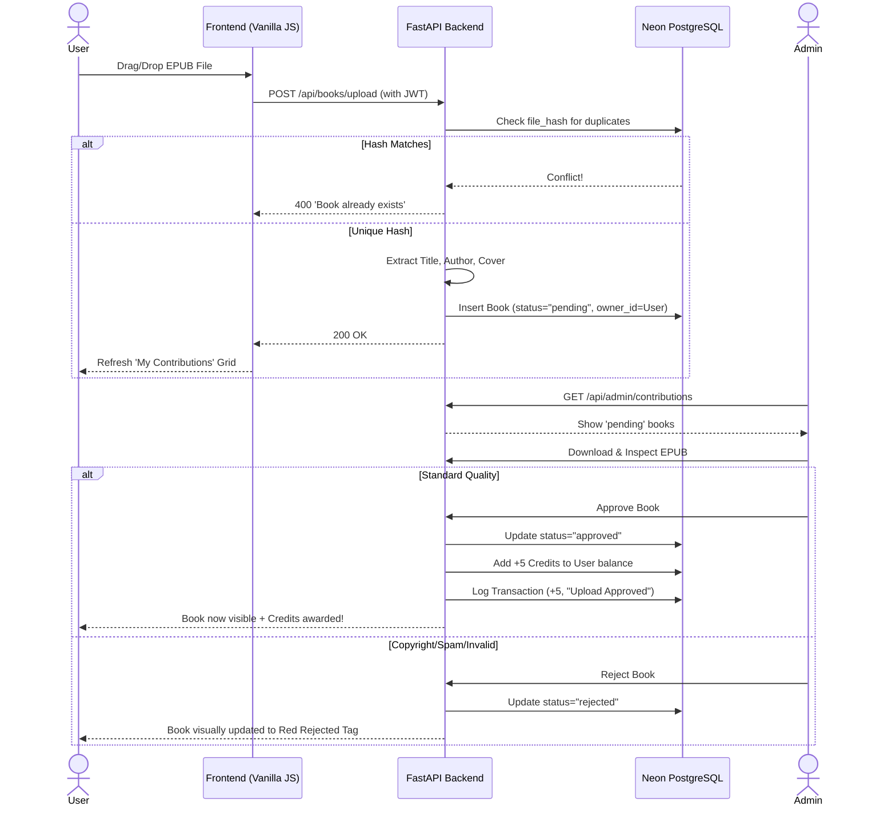

# BookShelf Architecture Diagram

This document provides a comprehensive visual representation of the BookShelf application's infrastructure and the lifecycle of a book contribution.

## 🏗️ High-Level System Architecture

This diagram details the cloud infrastructure, clearly differentiating between ephemeral computing environments and persistent cloud storage.

```mermaid
flowchart TD
    %% Define Styles
    classDef user fill:#2d3436,stroke:#74b9ff,stroke-width:2px,color:#fff
    classDef render fill:#0984e3,stroke:#fff,stroke-width:2px,color:#fff
    classDef neon fill:#00b894,stroke:#fff,stroke-width:2px,color:#fff
    classDef github fill:#2d3436,stroke:#fff,stroke-width:2px,color:#fff
    classDef email fill:#d63031,stroke:#fff,stroke-width:2px,color:#fff
    classDef ephemeral fill:#fdcb6e,stroke:#e17055,stroke-width:2px,color:#2d3436,stroke-dasharray: 5 5

    %% Nodes
    U((👤 User)):::user
    A((👑 Admin)):::user
    
    subgraph "☁️ Render.com (Cloud Hosting - Free Tier)"
        API[🚀 FastAPI Application]:::render
        FS[(📁 Ephemeral Storage \n /app/uploads/)]:::ephemeral
    end
    
    subgraph "☁️ Neon.tech (Cloud Database)"
        DB[(🐘 PostgreSQL DB \n Persistent State)]:::neon
    end
    
    subgraph "🔗 External Providers"
        GH[🐙 GitHub Repository]:::github
        SMTP[📧 Gmail SMTP]:::email
    end

    %% Connections
    U -->|HTTPS / UI| API
    A -->|HTTPS / Dashboard| API
    
    API -->|Read/Write Files \n (Lost on Restart)| FS
    API <-->|SQL / psycopg2 \n (Persistent Data)| DB
    
    API -->|Send Notifications| SMTP
    SMTP -->|EPUBs & Tokens| U
    
    GH -.->|Auto-Deploy on Push| API
```

### Key Components:
- **Render.com (Free Tier)**: Hosts the FastAPI application and serves the Vanilla JS frontend. Note that the local storage (`/app/uploads/` where EPUBs and covers go) is **ephemeral** and resets on deployments/restarts.
- **Neon.tech**: Provides the **Persistent** PostgreSQL database. User accounts, credit balances, book metadata, and transaction logs survive server restarts.
- **GitHub**: Source of truth. Pushing to `main` triggers an automatic redeployment on Render.
- **Gmail SMTP**: Handles delivery of EPUB files to user inboxes and sends verification/password reset tokens.

---

## 🏛️ Contribution Lifecycle (Sequence Diagram)

This diagram maps the exact flow of data when a user uploads a book to the platform.

